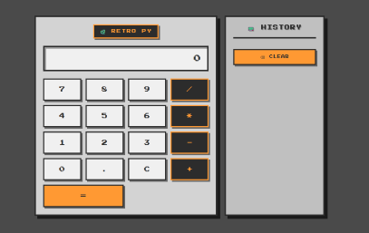

# 🐍 PyCalc - Retro Pixel Calculator

A stylish, retro-themed calculator built with Python (Flask) that features a pixel-art interface and calculation history. Perform basic arithmetic operations with a nostalgic 80s/90s computer terminal aesthetic.



## ✨ Features

- **🖩 Basic Operations**: Addition, subtraction, multiplication, division
- **📋 History Panel**: Stores your last 10 calculations on the right side
- **🎮 Pixel Art Design**: Retro terminal aesthetic with Press Start 2P font
- **⌨️ Keyboard Support**: Use your keyboard for faster calculations
- **🎨 Vintage Color Scheme**: Warm greys with orange accents for that authentic retro feel
- **📱 Responsive Layout**: Works on desktop and mobile devices
- **⚡ Real-time Calculations**: No page reloads needed (AJAX-powered)

## 🛠️ Technologies Used

- **Backend**: Python 3.x, Flask
- **Frontend**: HTML5, CSS3, JavaScript
- **Fonts**: Press Start 2P (Google Fonts)
- **Styling**: Pure CSS with pixel-art aesthetics


Feel free to reach out with questions, suggestions, or just to say hi! 😊

## 📦 Installation

1. **Clone the repository**
   ```bash
   git clone https://github.com/AndrianBarbulat/PyWebCalcPixel.git
   cd pycalc